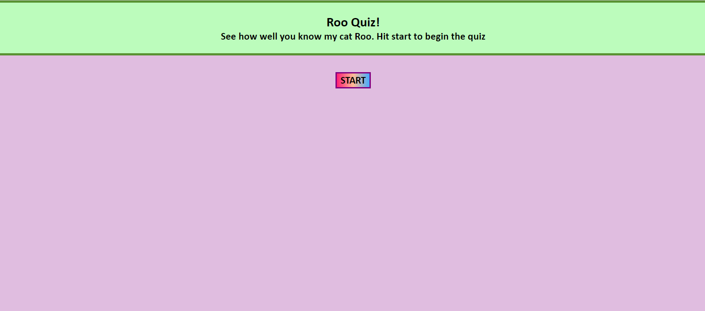
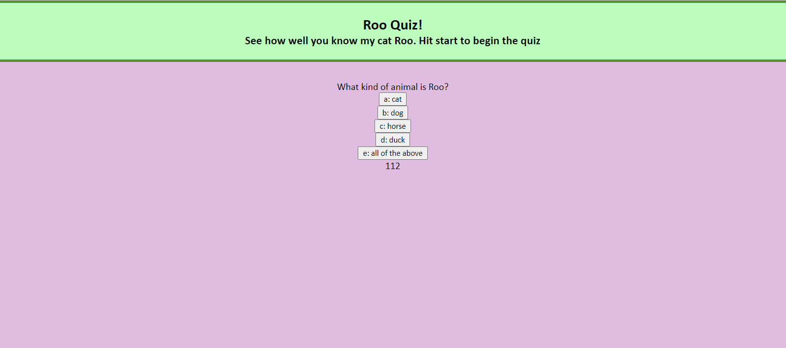
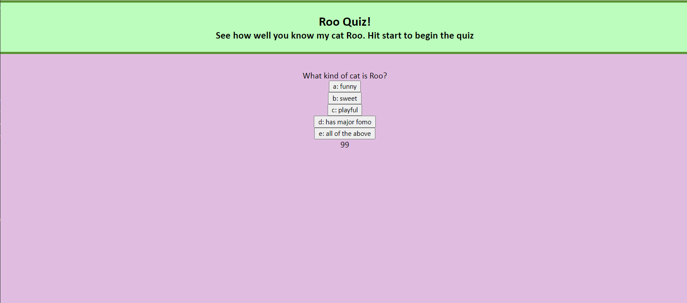
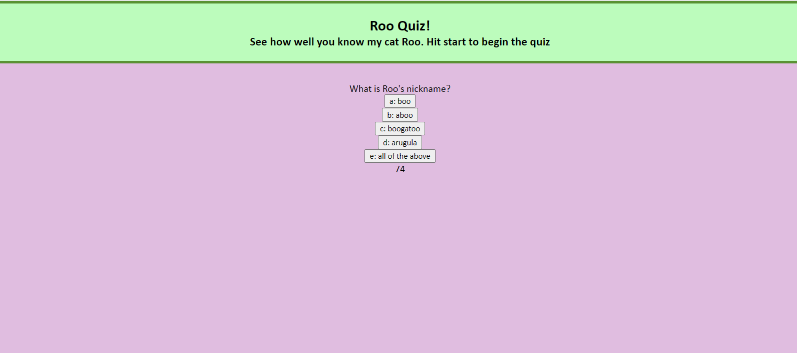
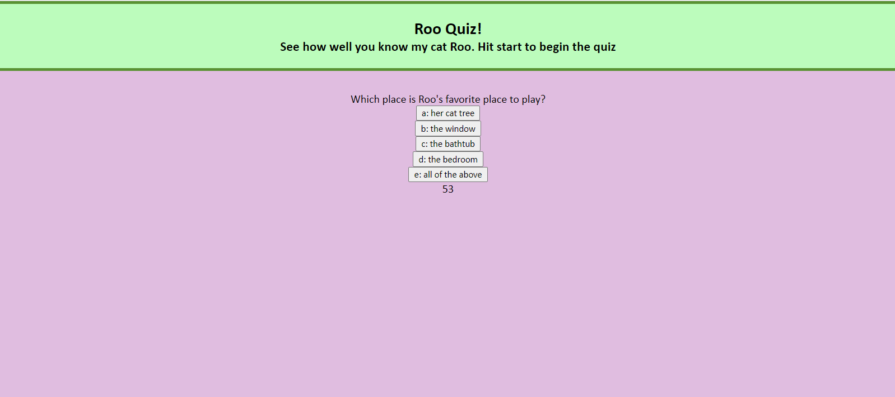
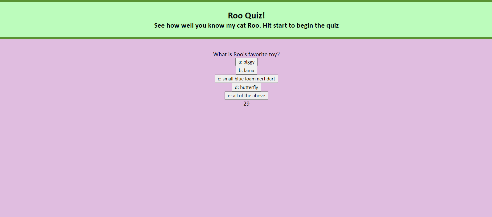
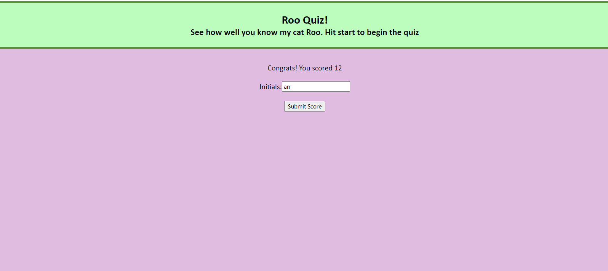
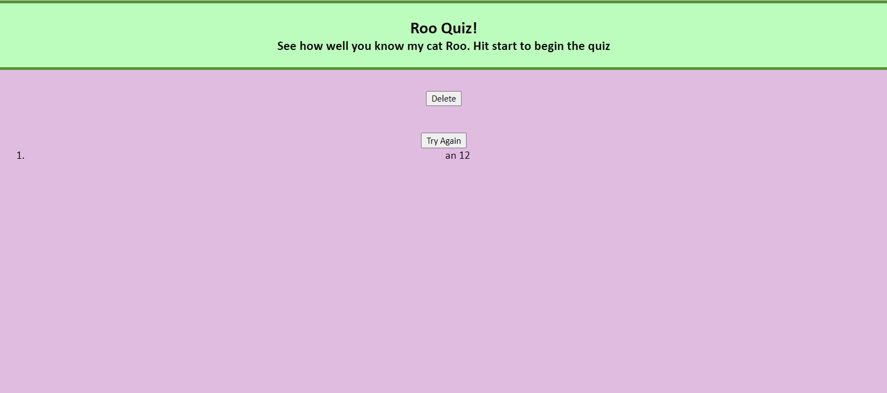
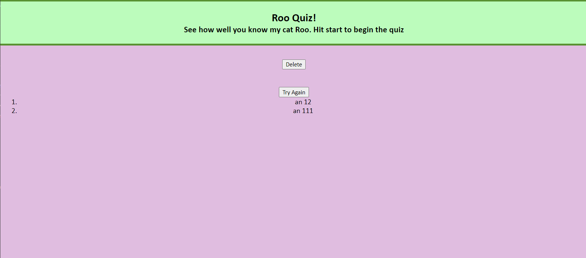

# roo-quiz

## Link
Roo Quiz https://allysonnostrand.github.io/roo-quiz/

## Description

The goal for this assignment was to create a timed quiz that once completed-- the user is able to save their scores to a score board and try again for a higher score. The quiz I created is about my cat "Roo" and it consists of 5 questions.

I started off by creating an html to resemble the first "page" of the quiz. It includes a start button that I have attached a function that will start the quiz. 

Upon starting the quiz, the html then is changed in javascript to show the first question and the timer. When selecting a wrong answer, 5 seconds is docked from the timer. When selecting the correct answer, the html will then display the next question. 

This continues until the user reaches the final question, which will then display an input for the user to type their initials to save their score(which is the time left in the end) to local storage. Once the submit button is hit after the user inputs their initials, a score board appears with their inputed initials and their score next to it. Not only that, but there is also a button to retake the quiz and to reset the storage and page. Upon clicking the try again button, the original html will be displayed and the user will be able to take the quiz again while their previous score will still be in the scoreboard. Upon clicking the delete button, the local storage and the display will be set back to its original state- displaying the beginning of the quiz. This makes it so if the user takes the quiz again, their previous score will no longer show up on the scoreboard. 

# Screenshots

Here is a look at what the website looks like and its functionality. 

User clicks start button and first question appears

second question

third question

fourth question

fifth question

User has completed the quiz and score is displayed on page with an input box for user initials

User hits submit and their score is displayed bellow 

User takes the quiz again and inputs their new score and initials. It gets displayed along with their old score

